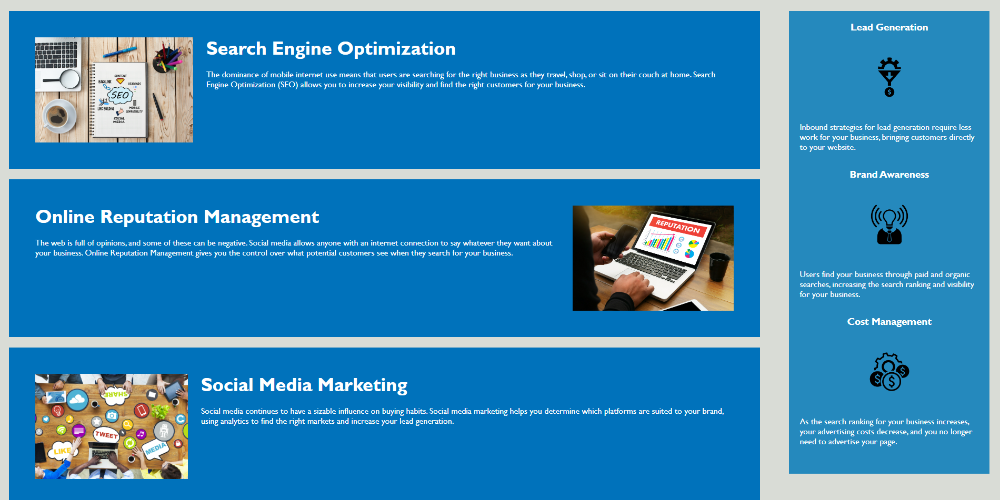

# week-1-challenge
Modify the starter code for the marketing agency code.

## Project Description
The page is split into 3 main parts, the header, footer and the main body.  
Header:

Body:

Footer:

Using the navigation in the top left of the header, you will be able to quickly navigate to those sections on the page.

## How to Get to the Page
The link to he repo for this project is located at: https://github.com/blanchardt/week-1-challenge  
You can use this link to get to the live site: https://blanchardt.github.io/week-1-challenge/

## Credits
Modified by: Trevor Blanchard
Original file location: https://github.com/coding-boot-camp/urban-octo-telegram
